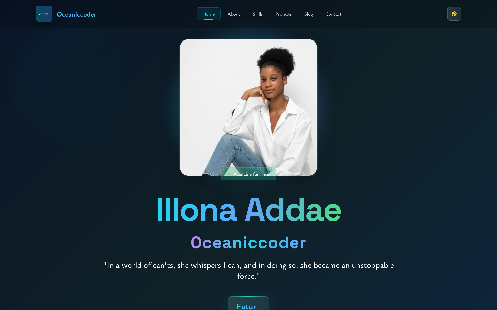

<!-- prettier-ignore -->
# ✨ Illona Addae | Oceanicoder 💖


# 🌊 Oceaniccoder — Personal Portfolio (v2)

A modern, elegant, and thoughtfully crafted developer portfolio built to showcase my work, values, and growth as a Software Engineer. This portfolio reflects my journey as a builder, leader, and community contributor — grounded in creativity, empathy, and purpose-driven innovation.

---

## ✨ Overview

This portfolio is a curated representation of who I am, what I build, and how I approach product and engineering. It highlights:

- Technical projects and case studies
- Skills & tooling (frontend, backend & cloud)
- Leadership & community contributions
- Personal mission & creative identity

It evolves as I learn and ship more work.

---

## 🛠️ Tech stack

| Category        | Tools                 |
| --------------- | --------------------- |
| Framework       | React (react-scripts) |
| Styling         | Tailwind CSS          |
| Build tooling   | react-scripts / npm   |
| Deployment      | Netlify               |
| Version control | Git & GitHub          |

Additional integrations:

- Web3Forms for contact form submissions
- Responsive, accessible layout with dark/light mode
- Optimized asset handling (WebP where possible)

---

## 🌟 Features

- Fully responsive UI (mobile-first)
- Dark / Light theme support
- Contact form powered by Web3Forms (no custom backend required)
- Accessible semantics and keyboard focus states
- Smooth micro-interactions for a polished experience

---

## 📂 Project structure

```text
Oceaniccoder-portfolio-v2/
├── public/               # Static assets & images
├── src/
│   ├── components/       # Modular UI components
│   ├── Context/          # Theme/context providers
	│   ├── hooks/            # Custom hooks
│   ├── styles/           # Tailwind + custom CSS
│   └── utils/data/       # projects, skills, blogs data
├── package.json
└── tailwind.config.js
```

---

## Live demo

Visit: [https://oceaniccoder.dev](https://oceaniccoder.dev) 🚀

## Snapshot



---

## Quick start (run locally)

1. Clone & enter the repo:

```bash
git clone <this-repo-url>
cd oceanicoder-portfolio-v2-fixed
```

1. Install dependencies:

```bash
npm install
# or
yarn
```

1. Start dev server:

```bash
npm start
# or
yarn start
```

1. Run tests / build:

```bash
npm test
npm run build
```

---

## Deployment

Build with `npm run build` and publish the `build/` directory to Netlify, Vercel, or GitHub Pages.

---

## Accessibility & performance

- Prevents flash-of-unstyled content with inline theme init
- Uses modern image formats where available
- Semantic HTML and ARIA where appropriate

---

## Notes for reviewers

- `public/index.html` — theme init + SEO meta tags
- `src/components/` — component implementations
- `src/utils/data/` — project and blog metadata

---

## Contributing

This is my personal portfolio; PRs that fix typos, accessibility issues, or content improvements are welcome. Open an issue or PR with context and I will review.

---

## License

MIT — attribution appreciated.

---

## Contact

- Illona Addae — Oceaniccoder
- Website: [https://oceaniccoder.dev](https://oceanicoder.dev)
- LinkedIn: [https://www.linkedin.com/in/illona-addae/](https://www.linkedin.com/in/illona-addae/)
- GitHub: [https://github.com/illonaaddae](https://github.com/illonaaddae)

---

“Technology should not only solve problems. It should uplift people.” — Oceaniccoder 🌊

Thanks for looking — I'd love to show you the code and the thinking behind it.
