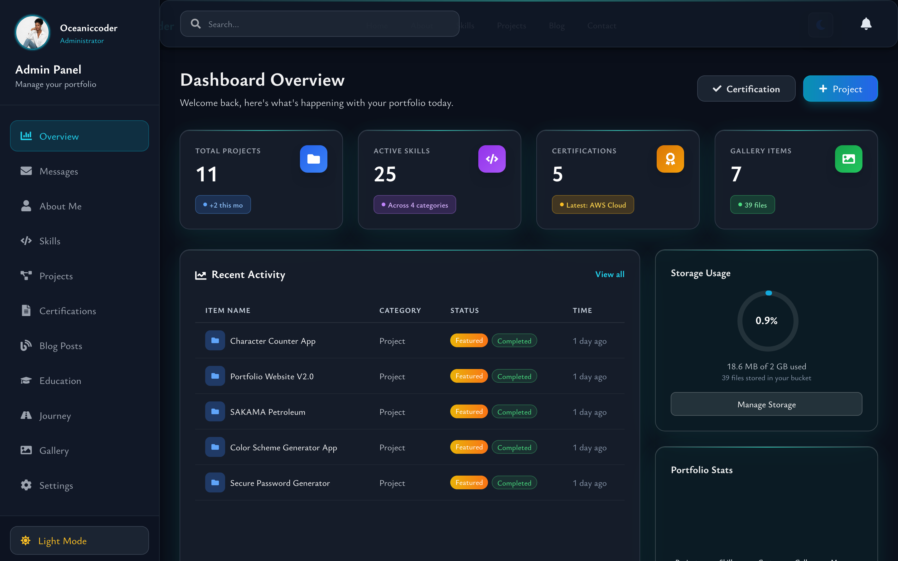
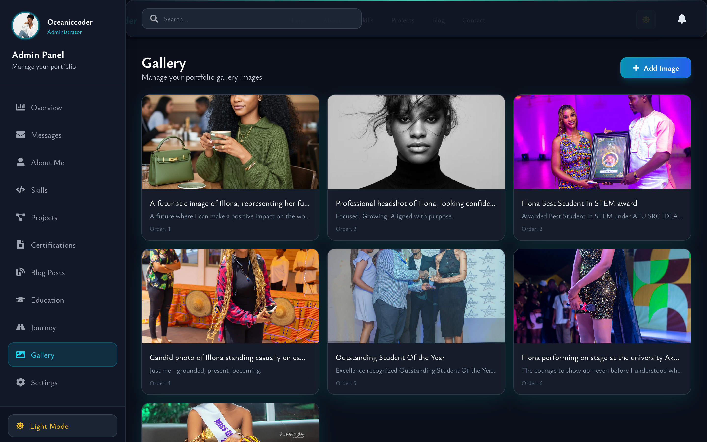
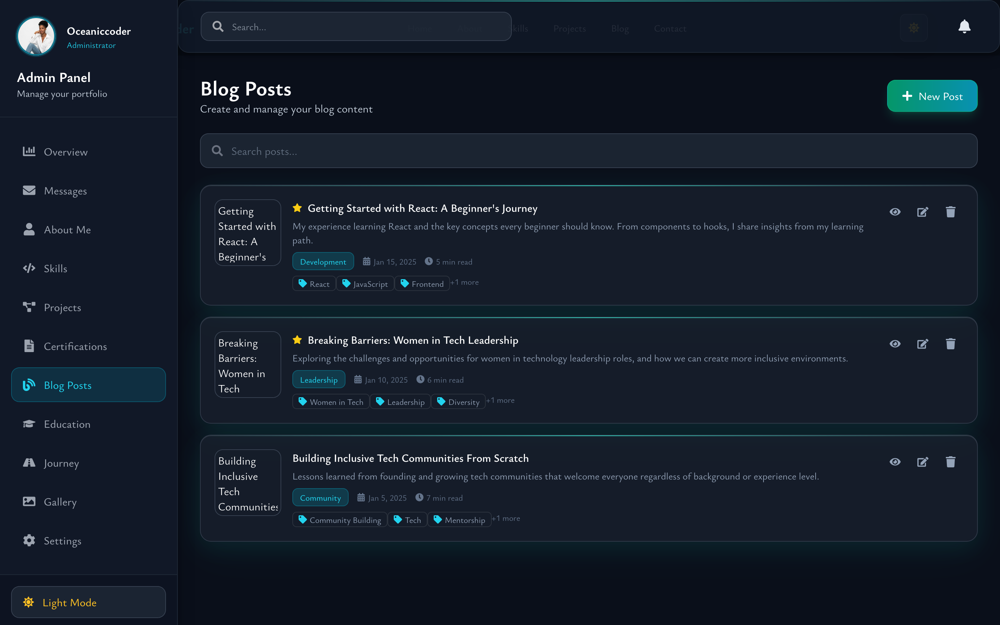
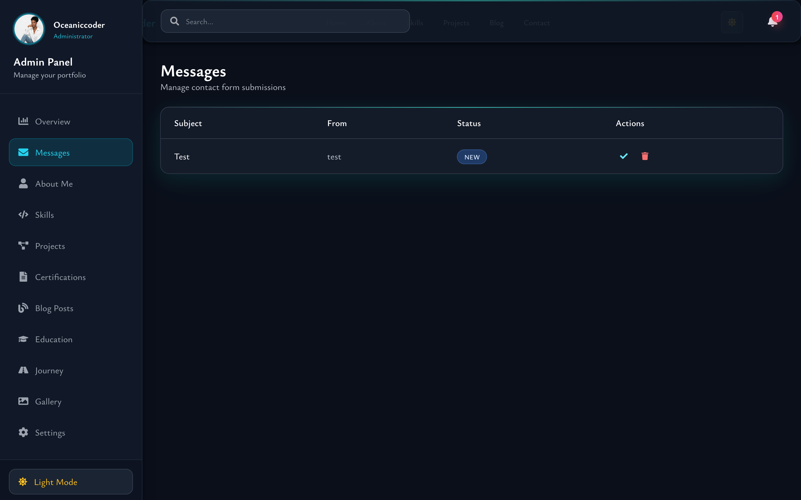

<div align="center">

# 🌊 Oceaniccoder Portfolio v2

### A Full-Stack Developer Portfolio with Admin Dashboard & Cloud Infrastructure

[](https://oceaniccoder.dev)
[](https://azure.microsoft.com)
[](https://www.typescriptlang.org/)
[](https://react.dev/)


<p align="center">
  <strong>A production-ready portfolio featuring a custom CMS, real-time data management, cloud deployment, and serverless functions.</strong>
</p>

[Live Demo](https://oceaniccoder.dev) • [Report Bug](https://github.com/illonaaddae/Oceaniccoder-portfolio-v2/issues) • [Request Feature](https://github.com/illonaaddae/Oceaniccoder-portfolio-v2/issues)

</div>

---

## 📸 Screenshots

### Portfolio Homepage


### Admin Dashboard

<!-- TODO: Add your dashboard screenshots here -->

|                          Dashboard Overview                           |                          Content Management                           |
| :-------------------------------------------------------------------: | :-------------------------------------------------------------------: |
|  |  |

|                       Blog Editor                       |                    Messages & Analytics                     |
| :-----------------------------------------------------: | :---------------------------------------------------------: |
|  |  |


---

## ✨ Key Features

### 🎨 Frontend Excellence

- **Modern React 18** with TypeScript for type-safe development
- **Responsive Design** — Mobile-first approach with Tailwind CSS
- **Dark/Light Theme** — System-aware with smooth transitions
- **Performance Optimized** — Code splitting, lazy loading, WebP images
- **Accessible** — WCAG compliant with keyboard navigation & ARIA labels

### 🛠️ Admin Dashboard (Custom CMS)

- **Secure Authentication** — Protected admin routes with Appwrite Auth
- **Content Management** — Full CRUD for projects, blogs, skills, certifications
- **Rich Text Editor** — Blog post creation with markdown support
- **Image Management** — Upload, optimize, and manage media assets
- **Message Center** — View and manage contact form submissions
- **Real-time Updates** — Instant data synchronization

### ☁️ Cloud Infrastructure

- **Azure Static Web Apps** — Global CDN, SSL, custom domain
- **Appwrite Backend** — Database, Storage, Authentication, Functions
- **Serverless Functions** — Email notifications on contact form submissions
- **CI/CD Pipeline** — Automated deployments via GitHub Actions

### 📬 Contact System

- **Dual Submission** — Netlify Forms + Appwrite Database backup
- **Email Notifications** — Automated alerts via Appwrite Messaging
- **Spam Protection** — Honeypot fields and rate limiting
- **Message Dashboard** — Track, filter, and respond to inquiries

---

## 🏗️ System Architecture

```
┌─────────────────────────────────────────────────────────────────┐
│                         CLIENT (React)                          │
├─────────────────────────────────────────────────────────────────┤
│  Components  │  Hooks  │  Context  │  Services  │  TypeScript   │
└──────────────────────────┬──────────────────────────────────────┘
                           │
                           ▼
┌─────────────────────────────────────────────────────────────────┐
│                    AZURE STATIC WEB APPS                        │
│         Global CDN • SSL/TLS • Custom Domain • CI/CD            │
└──────────────────────────┬──────────────────────────────────────┘
                           │
                           ▼
┌─────────────────────────────────────────────────────────────────┐
│                      APPWRITE CLOUD                             │
├─────────────────────────────────────────────────────────────────┤
│  📊 Databases    │  🗄️ Storage    │  🔐 Auth    │  📧 Messaging  │
│  - Projects      │  - Images      │  - Admin    │  - Email SMTP  │
│  - Blog Posts    │  - Documents   │  - Sessions │  - Notifications│
│  - Skills        │  - Media       │             │                │
│  - Messages      │                │             │                │
│  - Certifications│                │             │                │
└──────────────────────────┬──────────────────────────────────────┘
                           │
                           ▼
┌─────────────────────────────────────────────────────────────────┐
│                   SERVERLESS FUNCTIONS                          │
│              Contact Email Notification Trigger                 │
└─────────────────────────────────────────────────────────────────┘
```

---

## 🛠️ Tech Stack

### Frontend

| Technology          | Purpose                               |
| ------------------- | ------------------------------------- |
| **React 18**        | UI Framework with Concurrent Features |
| **TypeScript**      | Type Safety & Developer Experience    |
| **Tailwind CSS**    | Utility-First Styling                 |
| **Vite**            | Next-Gen Build Tool                   |
| **Framer Motion**   | Animations & Transitions              |
| **React Router v6** | Client-Side Routing                   |

### Backend & Cloud

| Technology                | Purpose                                        |
| ------------------------- | ---------------------------------------------- |
| **Appwrite**              | Backend-as-a-Service (Database, Auth, Storage) |
| **Azure Static Web Apps** | Hosting, CDN, SSL                              |
| **GitHub Actions**        | CI/CD Pipeline                                 |
| **Appwrite Functions**    | Serverless Event Handlers                      |
| **Gmail SMTP**            | Email Notifications                            |

### DevOps & Tooling

| Technology            | Purpose            |
| --------------------- | ------------------ |
| **Git & GitHub**      | Version Control    |
| **ESLint & Prettier** | Code Quality       |
| **PostCSS**           | CSS Processing     |
| **npm**               | Package Management |

---

## 📂 Project Structure

```
oceanicoder-portfolio-v2/
├── .github/
│   └── workflows/
│       └── azure-static-web-apps.yml    # CI/CD pipeline
├── appwrite-function/
│   ├── src/
│   │   └── main.js                      # Email notification function
│   └── package.json
├── public/
│   └── images/                          # Static assets
├── src/
│   ├── components/
│   │   ├── AdminDashboard/              # 🎛️ CMS Components
│   │   │   ├── index.tsx                # Dashboard layout
│   │   │   ├── Sidebar.tsx              # Navigation
│   │   │   ├── ImageUpload.tsx          # Media management
│   │   │   ├── useAdminData.ts          # Data hook
│   │   │   ├── tabs/                    # Content sections
│   │   │   └── modals/                  # CRUD modals
│   │   ├── ui/                          # Reusable UI components
│   │   └── *.jsx                        # Page sections
│   ├── Context/
│   │   └── index.tsx                    # Theme & App context
│   ├── hooks/
│   │   ├── usePortfolioData.ts          # Data fetching
│   │   └── useTheme.js                  # Theme management
│   ├── lib/
│   │   └── appwrite.ts                  # Appwrite client config
│   ├── services/
│   │   └── api.ts                       # API service layer
│   ├── types/
│   │   └── index.ts                     # TypeScript definitions
│   ├── utils/
│   │   ├── formatters.ts                # Data formatters
│   │   └── themeStyles.ts               # Theme utilities
│   └── styles/
│       └── index.css                    # Global styles
├── staticwebapp.config.json             # Azure SWA config
├── tailwind.config.js
├── tsconfig.json
└── vite.config.ts
```

---

## 🚀 Getting Started

### Prerequisites

- Node.js 18+
- npm or yarn
- Appwrite account (free tier available)

### Installation

1. **Clone the repository**

   ```bash
   git clone https://github.com/illonaaddae/Oceaniccoder-portfolio-v2.git
   cd Oceaniccoder-portfolio-v2
   ```

2. **Install dependencies**

   ```bash
   npm install
   ```

3. **Set up environment variables**

   ```bash
   cp .env.example .env.local
   ```

   Configure your `.env.local`:

   ```env
   VITE_APPWRITE_ENDPOINT=https://cloud.appwrite.io/v1
   VITE_APPWRITE_PROJECT_ID=your-project-id
   VITE_APPWRITE_DATABASE_ID=your-database-id
   VITE_APPWRITE_BUCKET_ID=your-bucket-id
   ```

4. **Start development server**

   ```bash
   npm run dev
   ```

5. **Build for production**
   ```bash
   npm run build
   ```

---

## 🔐 Admin Dashboard

The admin dashboard is accessible at `/admin` with authentication.

### Dashboard Features

| Feature               | Description                               |
| --------------------- | ----------------------------------------- |
| 📊 **Overview**       | Quick stats and recent activity           |
| 📁 **Projects**       | Manage portfolio projects with images     |
| 📝 **Blog**           | Create and edit blog posts with rich text |
| 🎓 **Education**      | Academic credentials management           |
| 🏆 **Certifications** | Professional certificates                 |
| 💼 **Journey**        | Career timeline entries                   |
| 🛠️ **Skills**         | Technical skills with proficiency levels  |
| 📸 **Gallery**        | Image management and uploads              |
| 📬 **Messages**       | Contact form submissions                  |
| ⚙️ **Settings**       | Site configuration                        |

---

## ☁️ Deployment

### Azure Static Web Apps (Production)

The site automatically deploys to Azure on push to `main`:

```yaml
# .github/workflows/azure-static-web-apps.yml
on:
  push:
    branches: [main]
  pull_request:
    branches: [main]
```

**Pipeline Steps:**

1. ✅ Checkout code
2. ✅ Setup Node.js 20
3. ✅ Install dependencies (`npm ci`)
4. ✅ Build (`npm run build`)
5. ✅ Deploy to Azure Static Web Apps

### Environment Variables (GitHub Secrets)

| Secret                            | Description            |
| --------------------------------- | ---------------------- |
| `AZURE_STATIC_WEB_APPS_API_TOKEN` | Azure deployment token |

---

## 🗄️ Database Schema (Appwrite)

### Collections

| Collection       | Key Fields                                                                        |
| ---------------- | --------------------------------------------------------------------------------- |
| `projects`       | title, description, technologies[], image, liveUrl, githubUrl, featured, category |
| `blog_posts`     | title, slug, content, excerpt, tags[], publishedAt, image, featured, published    |
| `skills`         | name, category, percentage, icon                                                  |
| `certifications` | title, issuer, date, credential, platform, image, verifyLink                      |
| `education`      | institution, degree, period, achievement, gpa, universityLogo                     |
| `journey`        | role, company, period, location, achievements[], order, color                     |
| `messages`       | name, email, subject, message, status                                             |
| `gallery`        | src, alt, caption, order                                                          |
| `settings`       | key, value                                                                        |
| `about`          | title, subtitle, story, profileImage, resumeUrl                                   |

### Serverless Function Trigger

```javascript
// Event: databases.*.collections.messages.documents.*.create
// Sends email notification when new contact message is received
```

---

## 📈 Performance Metrics

| Metric                       | Score |
| ---------------------------- | ----- |
| 🟢 Lighthouse Performance    | 95+   |
| 🟢 Lighthouse Accessibility  | 100   |
| 🟢 Lighthouse Best Practices | 100   |
| 🟢 Lighthouse SEO            | 100   |

### Optimizations Implemented

- ⚡ Code splitting with `React.lazy()` and `Suspense`
- 🖼️ WebP image format with fallbacks
- 📦 Tree-shaking with Vite
- 🗜️ Gzip/Brotli compression
- 🌐 CDN caching via Azure
- 🎯 Prefetching critical resources

---

## 🔄 Recent Updates

### v2.0.0 — Cloud Migration & Dashboard

- ✨ Migrated from Netlify to **Azure Static Web Apps**
- 🛠️ Built full **Admin Dashboard** with Appwrite backend
- 📊 Implemented **10+ database collections** for content management
- 📧 Added **serverless email notifications** via Appwrite Functions
- 🔐 Secure **authentication system** for admin access
- 📱 Enhanced **mobile responsiveness** across all pages
- 🎨 Improved **dark/light theme** with system preference detection
- ⚡ **TypeScript migration** for type safety

---

## 🤝 Contributing

Contributions are welcome! This is an open-source portfolio that others can learn from and adapt.

1. Fork the repository
2. Create your feature branch (`git checkout -b feature/AmazingFeature`)
3. Commit your changes (`git commit -m 'Add some AmazingFeature'`)
4. Push to the branch (`git push origin feature/AmazingFeature`)
5. Open a Pull Request

---

## 📄 License

This project is licensed under the MIT License — see the [LICENSE](LICENSE) file for details.

---

## 👩🏾‍💻 About the Developer

<div align="center">

**Illona Addae** — _Software Engineer & Tech Leader_

Building products that uplift communities through technology.

[](https://oceaniccoder.dev)
[](https://www.linkedin.com/in/illona-addae/)
[](https://github.com/illonaaddae)
[](https://twitter.com/illonaaddae)

</div>

---

<div align="center">

### 💬 Let's Connect!

I'm always open to discussing new opportunities, collaborations, or just chatting about tech.

**"Technology should not only solve problems. It should uplift people."** 🌊

---

⭐ **Star this repo** if you found it helpful!

</div>
