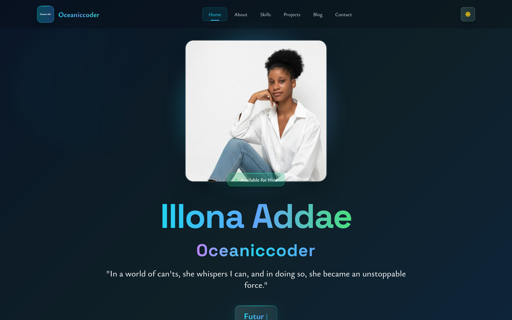
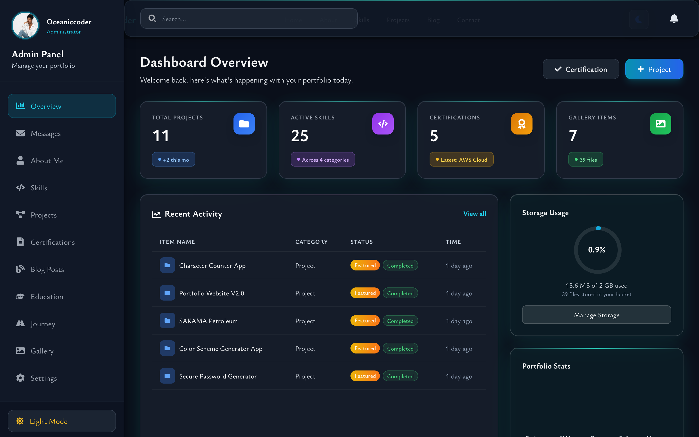
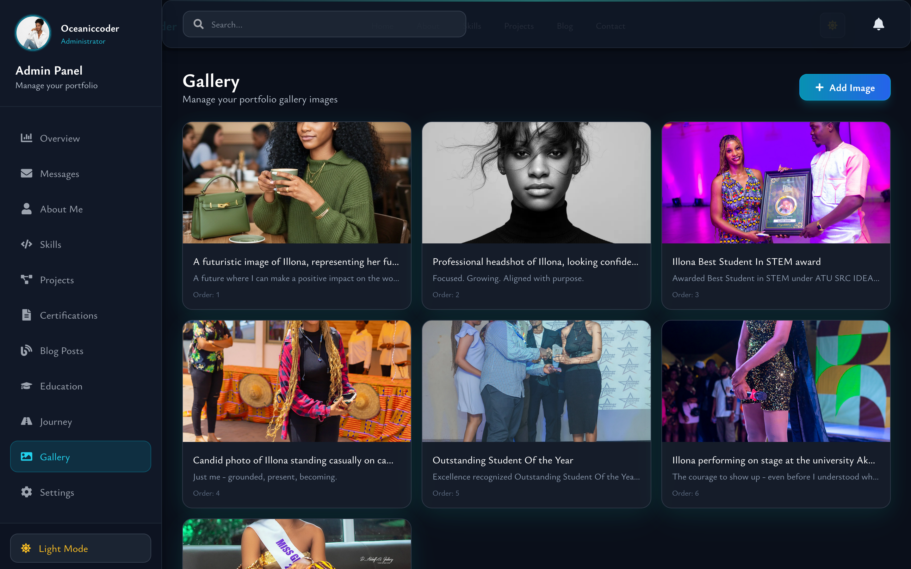
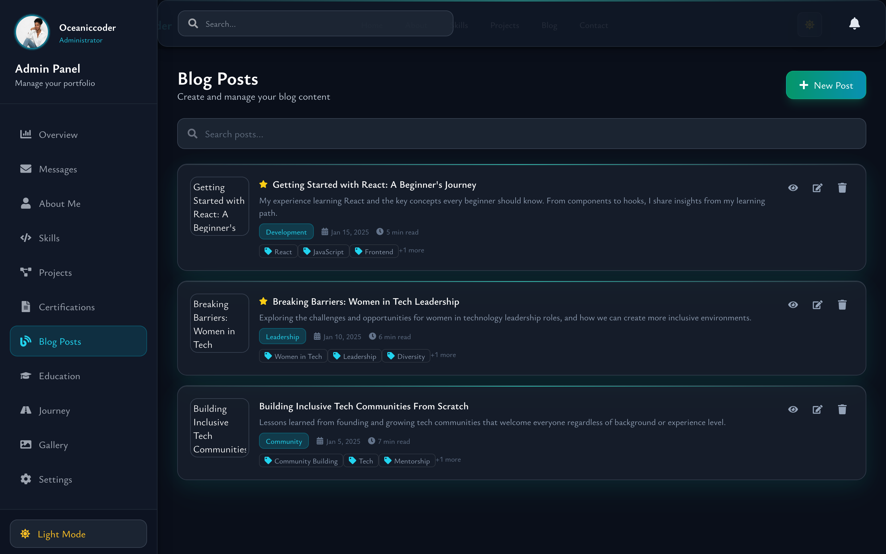
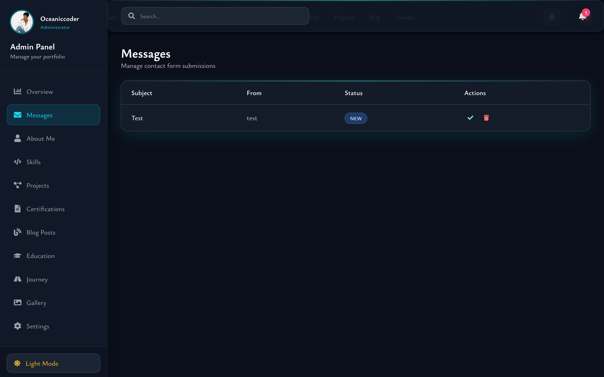

<div align="center">

# Oceaniccoder Portfolio v2

### A Full-Stack Developer Portfolio with Admin Dashboard, Booking System & Cloud Infrastructure

[](https://oceaniccoder.dev)
[](https://azure.microsoft.com)
[](https://www.typescriptlang.org/)
[](https://react.dev/)


<p align="center">
  <strong>A production-ready portfolio featuring a custom CMS, real-time booking system, Google Calendar + Zoom integration, AI chatbot, and serverless cloud infrastructure on Azure.</strong>
</p>

[Live Demo](https://oceaniccoder.dev) • [Report Bug](https://github.com/illonaaddae/Oceaniccoder-portfolio-v2/issues) • [Request Feature](https://github.com/illonaaddae/Oceaniccoder-portfolio-v2/issues)

</div>

---

## Screenshots

### Portfolio Homepage



### Admin Dashboard

|                     Dashboard Overview                      |                     Content Management                      |
| :---------------------------------------------------------: | :---------------------------------------------------------: |
|  |  |

|                  Blog Editor                  |               Messages & Analytics                |
| :-------------------------------------------: | :-----------------------------------------------: |
|  |  |

---

## ✨ Key Features

### 🖥️ Frontend Excellence

- **Modern React 19** with TypeScript for type-safe development
- **Responsive Design** — Mobile-first with Tailwind CSS, tested on iOS & Android
- **Dark/Light Theme** — System-aware with smooth transitions across every component
- **Performance Optimized** — Code splitting, lazy loading, WebP images
- **Accessible** — WCAG compliant with keyboard navigation & ARIA labels
- **AI Chatbot** — Context-aware assistant powered by OpenAI GPT-4o-mini via Azure Functions

### 📅 Booking System

- **Multi-step booking form** — Info → Schedule (type + date + time + platform) → Message → Confirmation
- **Platform choice** — Visitor picks Google Meet or Zoom as their preferred meeting platform
- **Google Calendar integration** — Auto-creates calendar events with Google Meet links (OAuth published — no token expiry)
- **Zoom integration** — Server-to-Server OAuth creates Zoom meetings instantly when Zoom is selected
- **Real-time slot availability** — Google Calendar freebusy API disables already-busy time slots
- **Server-side double-booking guard** — Azure Function checks Appwrite with an API key (guests can't bypass); returns 409 if slot is taken
- **Timezone-aware** — Detects and displays the visitor's local timezone
- **4 meeting types** — Discovery Call (30 min), Project Discussion (60 min), Mentorship (45 min), General Chat (30 min)
- **Booking confirmation** — Reference number + Google Meet or Zoom join link shown immediately

### 🤖 AI Chatbot

- Powered by **OpenAI GPT-4o-mini** via Azure Function proxy
- Context-aware — knows about skills, projects, experience, services, and booking
- **Rate limited** — 20 requests/minute per IP; auto-purges stale entries
- **Clear chat** button resets conversation to welcome state
- Mobile-optimised — `font-size: 16px` input prevents iOS Safari zoom
- Gracefully handles errors and offline states

### 🛡️ Admin Dashboard (Custom CMS)

- **Secure authentication** — Password-hashed login with `crypto.subtle` SHA-256; protected at `/admin/dashboard`
- **Public read-only view** — Portfolio stats visible at `/dashboard` without login; sensitive tabs (Bookings, Settings) hidden and render-blocked
- **Bookings management** — Accept, decline, cancel, and delete meeting requests; real-time 30-second polling; pending count badge in sidebar
- **Full content CRUD** — Projects, blog posts, skills, certifications, education, journey timeline, gallery
- **Rich text blog editor** — Create and edit posts with markdown support, tags, and featured toggles
- **Image & PDF uploads** — Upload, optimize, and manage media assets via Appwrite Storage
- **Message centre** — View, filter, and manage contact form submissions
- **Comments moderation** — Approve or remove visitor comments
- **Testimonials management** — Add, edit, and delete client testimonials

### ☁️ Cloud Infrastructure

- **Azure Static Web Apps** — Global CDN, SSL/TLS, custom domain, serves both frontend and Azure Functions
- **Azure Functions** — Serverless endpoints co-located at `/api/*` on the same domain (no CORS friction)
- **Appwrite Cloud** — Database, Storage, Authentication, Messaging
- **Dual CI/CD pipeline** — Azure deployment on push to `main`; ESLint + security lint in a separate CI workflow
- **GitHub Actions** — Automated builds, linting, and deployments

### 📬 Contact System

- **Dual submission** — Web3Forms + Appwrite Database backup
- **Email notifications** — Automated alerts via Appwrite Messaging
- **Spam protection** — Honeypot fields
- **Message dashboard** — Track, filter, and respond to inquiries

---

## 🏗️ System Architecture

```text
┌─────────────────────────────────────────────────────────────────┐
│                         CLIENT (React 19)                       │
├──────────────┬──────────┬───────────┬────────────┬─────────────┤
│  Components  │  Hooks   │  Context  │  Services  │  TypeScript │
└──────────────┴──────────┴─────┬─────┴────────────┴─────────────┘
                                │
                                ▼
┌─────────────────────────────────────────────────────────────────┐
│                    AZURE STATIC WEB APPS                        │
│         Global CDN • SSL/TLS • Custom Domain • CI/CD            │
│                    oceaniccoder.dev                             │
└──────────┬──────────────────────────────────────┬──────────────┘
           │                                      │
           ▼                                      ▼
┌─────────────────────┐              ┌────────────────────────────┐
│   APPWRITE CLOUD    │              │     AZURE FUNCTIONS        │
├──────────┬──────────┤              │    (api/* same domain)     │
│ Database │ Storage  │              ├────────────┬───────────────┤
│ Bookings │ Images   │◄─────────────│ create-    │ get-          │
│ Projects │ PDFs     │  API key     │ booking    │ availability  │
│ Blogs    │          │  (server     │ (Calendar  │ (freebusy     │
│ Messages │ Auth     │   only)      │  + Zoom)   │  check)       │
│ etc.     │ Sessions │              ├────────────┤               │
└──────────┴──────────┘              │ chat       │               │
                                     │ (OpenAI    │               │
                                     │  proxy)    │               │
                                     └─────┬──────┴───────────────┘
                                           │
                        ┌──────────────────┴──────────────────┐
                        ▼                                      ▼
           ┌────────────────────────┐          ┌──────────────────────────┐
           │     GOOGLE APIs        │          │       ZOOM API           │
           │ Calendar • Meet Links  │          │ Server-to-Server OAuth   │
           └────────────────────────┘          └──────────────────────────┘
```

---

## 🛠️ Tech Stack

### Frontend

| Technology          | Purpose                               |
| ------------------- | ------------------------------------- |
| **React 19**        | UI framework with concurrent features |
| **TypeScript**      | Type safety & developer experience    |
| **Tailwind CSS**    | Utility-first styling                 |
| **Vite**            | Next-gen build tool                   |
| **Framer Motion**   | Animations & transitions              |
| **React Router v6** | Client-side routing                   |

### Backend & Cloud

| Technology                | Purpose                                        |
| ------------------------- | ---------------------------------------------- |
| **Appwrite Cloud**        | Database, Auth, Storage, Messaging             |
| **Azure Static Web Apps** | Hosting, CDN, SSL, Azure Functions runtime     |
| **Azure Functions**       | Serverless: booking, availability, AI chat     |
| **Google Calendar API**   | Meeting event creation & freebusy availability |
| **Google Meet**           | Auto-generated video call links for bookings   |
| **Zoom API**              | Server-to-Server OAuth meeting creation        |
| **OpenAI GPT-4o-mini**    | AI chatbot powering portfolio Q&A              |
| **Web3Forms**             | Contact form submissions                       |
| **Gmail SMTP**            | Email notifications via Appwrite Messaging     |

### DevOps & Tooling

| Technology         | Purpose                        |
| ------------------ | ------------------------------ |
| **Git & GitHub**   | Version control                |
| **GitHub Actions** | CI/CD + lint + security checks |
| **Vitest**         | Unit & integration testing     |
| **ESLint**         | Code quality & accessibility   |
| **PostCSS**        | CSS processing                 |
| **npm**            | Package management             |

---

## 📁 Project Structure

```text
oceanicoder-portfolio-v2/
├── .github/
│   └── workflows/
│       ├── azure-static-web-apps.yml   # Azure deployment pipeline
│       └── ci.yml                      # Lint, test & security CI
├── api/                                # Azure Functions (served at /api/*)
│   ├── create-booking/
│   │   ├── index.js                    # Google Calendar + Zoom meeting creation
│   │   └── function.json
│   ├── get-availability/
│   │   ├── index.js                    # Google Calendar freebusy slot check
│   │   └── function.json
│   └── chat/
│       ├── index.js                    # AI chatbot (OpenAI GPT-4o-mini proxy)
│       └── function.json
├── public/
│   ├── sw.js                           # Service worker with kill-switch versioning
│   └── images/                         # Static assets
├── src/
│   ├── components/
│   │   ├── AdminDashboard/             # CMS — full dashboard layout
│   │   │   ├── index.tsx               # Dashboard root
│   │   │   ├── Sidebar.tsx             # Navigation (hides Bookings & Settings in read-only)
│   │   │   └── tabs/
│   │   │       ├── BookingsTab.tsx     # Booking management (admin only)
│   │   │       ├── Overview/           # Stats & recent activity
│   │   │       ├── MessagesTab.tsx     # Contact submissions
│   │   │       ├── CommentsTab.tsx     # Visitor comments moderation
│   │   │       ├── TestimonialsTab.tsx # Testimonials management
│   │   │       ├── ProjectsTab.tsx     # Portfolio projects
│   │   │       ├── BlogTab.tsx         # Blog post editor
│   │   │       ├── SkillsTab.tsx       # Skills & proficiency
│   │   │       ├── CertificationsTab.tsx
│   │   │       ├── GalleryTab.tsx
│   │   │       ├── JourneyTab.tsx
│   │   │       ├── EducationTab.tsx
│   │   │       ├── AboutTab.tsx
│   │   │       └── SettingsTab.tsx     # Password & site config (admin only)
│   │   ├── BookingSection.jsx          # Multi-step booking form (Google Meet + Zoom)
│   │   ├── Chatbot/                    # AI chatbot widget (OpenAI, rate-limited)
│   │   ├── Contact/                    # Contact form components
│   │   ├── Projects/                   # Portfolio project cards
│   │   ├── Confetti.tsx                # Celebration animation
│   │   ├── EventBanner.tsx             # Birthday / New Year banners
│   │   └── SupportButton.tsx           # Floating support & promo links
│   ├── services/
│   │   └── api/
│   │       ├── bookings.ts             # Booking CRUD + slot availability
│   │       ├── auth.ts                 # SHA-256 password hashing & verification
│   │       └── client.ts              # Appwrite client config
│   ├── utils/
│   │   └── apiUrl.ts                   # Relative /api/* paths → Azure Functions
│   ├── hooks/
│   │   ├── usePortfolioData.ts
│   │   └── useTheme.js
│   └── types/
│       └── index.ts
├── staticwebapp.config.json            # Azure SWA routing + /api/* function binding
├── tailwind.config.js
├── tsconfig.json
└── vite.config.ts                      # Proxies /api/* to :7071 in local dev
```

---

## 🚀 Getting Started

### Prerequisites

- Node.js 18+
- npm
- Appwrite account (free tier works)
- Azure Functions Core Tools v4 (`npm i -g azure-functions-core-tools@4`) — for local function testing
- Google Cloud project with Calendar API enabled

### Installation

1. **Clone the repository**

   ```bash
   git clone https://github.com/illonaaddae/Oceaniccoder-portfolio-v2.git
   cd Oceaniccoder-portfolio-v2
   ```

2. **Install dependencies**

   ```bash
   npm install
   ```

3. **Set up environment variables**

   ```bash
   cp .env.example .env.local
   ```

   Configure `.env.local` (baked at build time by Vite):

   ```env
   VITE_APPWRITE_ENDPOINT=https://fra.cloud.appwrite.io/v1
   VITE_APPWRITE_PROJECT_ID=your-project-id
   VITE_APPWRITE_DATABASE_ID=your-database-id
   VITE_APPWRITE_BUCKET_ID=your-bucket-id
   VITE_ADMIN_EMAIL=your-admin-email
   VITE_ADMIN_PASSWORD_HASH=your-sha256-hashed-password
   ```

   For Azure Functions (set in Azure Portal → Static Web App → Environment variables):

   ```env
   # Google Calendar
   GOOGLE_CLIENT_ID=your-client-id
   GOOGLE_CLIENT_SECRET=your-client-secret
   GOOGLE_REFRESH_TOKEN=your-refresh-token      # Regenerate if expired
   GOOGLE_CALENDAR_ID=your-calendar-email

   # Zoom (Server-to-Server OAuth)
   ZOOM_ACCOUNT_ID=your-account-id
   ZOOM_CLIENT_ID=your-client-id
   ZOOM_CLIENT_SECRET=your-client-secret

   # Appwrite server-side (double-booking guard)
   APPWRITE_API_KEY=your-server-api-key         # databases.read scope

   # AI Chatbot
   OPENAI_API_KEY=your-openai-api-key
   ```

4. **Start development server**

   ```bash
   # Frontend only (Azure Functions proxied via vite.config.ts)
   npm run dev

   # Frontend + Azure Functions (full local stack)
   # Terminal 1:
   npm run dev
   # Terminal 2:
   npx func start
   ```

5. **Run tests**

   ```bash
   npm test
   ```

6. **Build for production**

   ```bash
   npm run build
   ```

---

## 🗂️ Admin Dashboard

| Route              | Access        | Description                                       |
| ------------------ | ------------- | ------------------------------------------------- |
| `/admin/dashboard` | Password only | Full CMS — all tabs including Bookings & Settings |
| `/dashboard`       | Public        | Read-only portfolio stats; sensitive tabs hidden  |

### Dashboard Tabs

| Tab                | Admin | Public | Description                                         |
| ------------------ | :---: | :----: | --------------------------------------------------- |
| **Overview**       |  ✅   |   ✅   | Stats, recent activity, site views                  |
| **Bookings**       |  ✅   |   ❌   | Meeting requests — accept, decline, delete          |
| **Messages**       |  ✅   |  ✅\*  | Contact submissions (\*PII blurred in public view)  |
| **Comments**       |  ✅   |  ✅\*  | Visitor comments (\*content blurred in public view) |
| **Projects**       |  ✅   |   ✅   | Portfolio projects CRUD                             |
| **Blog**           |  ✅   |   ✅   | Blog post editor with rich text                     |
| **Skills**         |  ✅   |   ✅   | Skills & proficiency levels                         |
| **Certifications** |  ✅   |   ✅   | Professional certificates with PDF upload           |
| **Education**      |  ✅   |   ✅   | Academic credentials                                |
| **Journey**        |  ✅   |   ✅   | Career timeline entries                             |
| **Gallery**        |  ✅   |   ✅   | Image uploads with drag-to-reorder                  |
| **Testimonials**   |  ✅   |   ✅   | Client testimonials                                 |
| **About**          |  ✅   |   ✅   | Profile, story, resume URL                          |
| **Settings**       |  ✅   |   ❌   | Password change & site config                       |

---

## 📅 Booking System

The booking page (`/booking`) lets visitors schedule a meeting without any back-and-forth email.

### Booking Flow

```text
Step 1 — Your Info    →  Name, Email, Phone
Step 2 — Schedule     →  Meeting type, Date, Time slot, Platform (Google Meet or Zoom)
Step 3 — Message      →  Optional context or questions
Step 4 — Confirmation →  Booking reference + Meet/Zoom join link
```

### How it works

1. Visitor picks a date → Azure Function checks Google Calendar freebusy API; taken slots appear disabled
2. On submit → Azure Function checks Appwrite with a server-side API key for double-booking (returns 409 if taken)
3. If **Google Meet** selected → Azure Function creates Google Calendar event and returns a Meet link
4. If **Zoom** selected → Azure Function uses Server-to-Server OAuth to create a Zoom meeting and returns the join URL
5. Booking saved to Appwrite with `pending` status and the meeting link stored for admin resend
6. Admin reviews bookings in the dashboard; can accept, decline, or delete

### Azure Functions

| Function           | Endpoint                    | Purpose                                              |
| ------------------ | --------------------------- | ---------------------------------------------------- |
| `create-booking`   | `POST /api/create-booking`  | Double-booking check, Calendar event or Zoom meeting |
| `get-availability` | `GET /api/get-availability` | Returns freebusy map for a given date                |
| `chat`             | `POST /api/chat`            | AI chatbot — proxies to OpenAI, rate-limited         |

---

## 🤖 AI Chatbot

A floating chatbot widget (bottom-right) lets visitors ask questions about the portfolio.

- Powered by **OpenAI GPT-4o-mini** via an Azure Function proxy
- **Rate limited** — 20 requests/minute per IP, in-memory with automatic cleanup
- **Clear chat** — Trash icon in header resets conversation to welcome state
- Context-aware — knows Illona's skills, projects, services, and booking options
- Handles inline Markdown-style links `[text](/path)` — renders as clickable React Router links or external anchors
- Mobile-optimised — `font-size: 16px` input prevents iOS Safari zoom

---

## 🗄️ Database Schema (Appwrite)

### Collections

| Collection       | Key Fields                                                                                                                                            |
| ---------------- | ----------------------------------------------------------------------------------------------------------------------------------------------------- |
| `projects`       | title, description, technologies[], image, liveUrl, githubUrl, featured, category                                                                     |
| `blog_posts`     | title, slug, content, excerpt, tags[], publishedAt, image, featured, published                                                                        |
| `blog_reactions` | postId, visitorId, reaction (like/dislike)                                                                                                            |
| `skills`         | name, category, percentage, icon                                                                                                                      |
| `certifications` | title, issuer, date, credential, platform, image, verifyLink                                                                                          |
| `education`      | institution, degree, period, achievement, gpa, universityLogo                                                                                         |
| `journey`        | role, company, period, location, achievements[], order, color                                                                                         |
| `messages`       | name, email, subject, message, status                                                                                                                 |
| `bookings`       | name, email, phone, meetingType, preferredDate, preferredTime, timezone, message, status, preferredPlatform, meetingLink, zoomLink, calendarEventLink |
| `gallery`        | src, alt, caption, order                                                                                                                              |
| `settings`       | key, value                                                                                                                                            |
| `about`          | title, subtitle, story, profileImage, resumeUrl                                                                                                       |

---

## 🚢 Deployment

### Azure Static Web Apps (Production)

The site automatically deploys to Azure on push to `main`. Both the React frontend and all Azure Functions (`api/*`) are deployed together.

```yaml
# .github/workflows/azure-static-web-apps.yml
on:
  push:
    branches: [main]
  pull_request:
    branches: [main]
```

**Pipeline steps:**

1. Checkout code
2. Setup Node.js 20
3. Install dependencies (`npm ci`)
4. Build (`npm run build`)
5. Deploy frontend + Azure Functions to Azure Static Web Apps

### Environment Variables

**GitHub Secrets** (for CI/CD):

| Secret                            | Description            |
| --------------------------------- | ---------------------- |
| `AZURE_STATIC_WEB_APPS_API_TOKEN` | Azure deployment token |

**Azure Portal → Static Web App → Environment variables** (runtime, Azure Functions):

| Variable               | Purpose                                              |
| ---------------------- | ---------------------------------------------------- |
| `GOOGLE_CLIENT_ID`     | OAuth client for Calendar API                        |
| `GOOGLE_CLIENT_SECRET` | OAuth secret                                         |
| `GOOGLE_REFRESH_TOKEN` | Long-lived refresh token (published app — no expiry) |
| `GOOGLE_CALENDAR_ID`   | Calendar ID (usually your email)                     |
| `ZOOM_ACCOUNT_ID`      | Zoom Server-to-Server OAuth account ID               |
| `ZOOM_CLIENT_ID`       | Zoom app client ID                                   |
| `ZOOM_CLIENT_SECRET`   | Zoom app client secret                               |
| `APPWRITE_API_KEY`     | Server-side Appwrite key (databases.read)            |
| `OPENAI_API_KEY`       | OpenAI API key for chatbot                           |

**GitHub Secrets → Actions** (baked into frontend at build time):

| Secret                      | Purpose                 |
| --------------------------- | ----------------------- |
| `VITE_APPWRITE_ENDPOINT`    | Appwrite API endpoint   |
| `VITE_APPWRITE_PROJECT_ID`  | Appwrite project        |
| `VITE_APPWRITE_DATABASE_ID` | Appwrite database       |
| `VITE_APPWRITE_BUCKET_ID`   | Appwrite storage bucket |
| `VITE_ADMIN_EMAIL`          | Admin account email     |
| `VITE_ADMIN_PASSWORD_HASH`  | SHA-256 fallback hash   |

---

## 📊 Performance Metrics

| Metric                    | Score |
| ------------------------- | ----- |
| Lighthouse Performance    | 95+   |
| Lighthouse Accessibility  | 100   |
| Lighthouse Best Practices | 100   |
| Lighthouse SEO            | 100   |

### Optimisations Implemented

- Code splitting with `React.lazy()` and `Suspense`
- WebP image format with fallbacks
- Tree-shaking with Vite
- Gzip/Brotli compression via Azure CDN
- Prefetching critical resources
- iOS-safe `font-size: 16px` on all inputs (prevents Safari zoom)
- Service worker with versioned kill-switch for cache invalidation

---

## 📝 Changelog

### v2.4.0 — Zoom Integration, Security & Chatbot Improvements

- **Zoom meeting platform** — Platform picker in step 2 lets visitors choose Google Meet or Zoom; Azure Function creates Zoom meeting via Server-to-Server OAuth
- **Server-side double-booking** — Azure Function checks Appwrite with API key; 409 response with user-friendly back-link to re-pick time
- **Google OAuth published** — OAuth app moved to production; refresh tokens no longer expire after 7 days
- **Appwrite schema extended** — Added `preferredPlatform`, `zoomLink`, `meetingLink`, `calendarEventLink` columns to bookings collection
- **Chatbot: link rendering fix** — `renderContent` split regex replaced with `exec()` loop; no more duplicate label/URL text after links
- **Chatbot: rate limiting** — 20 req/min per IP with in-memory cleanup; blocks API abuse
- **Chatbot: clear chat** — Trash icon in header resets conversation to welcome state
- **Chatbot: system prompt** — Updated domain, Azure skill %, and platform booking info
- **Platform picker brand colors** — Selected state uses site's `var(--accent-teal)` instead of raw blue hex

### v2.3.0 — Booking System, AI Chatbot & Security

- **Booking system** — Full multi-step booking form with Google Calendar & Meet integration
- **Real-time slot availability** — Freebusy API disables taken slots before user picks them
- **Admin Bookings tab** — Accept, decline, cancel, and delete meeting requests with live polling
- **AI chatbot** — GPT-4o-mini powered assistant; mobile-safe input (no iOS zoom)
- **Dashboard security** — Bookings and Settings tabs removed from public `/dashboard`; render-blocked on `isReadOnly`
- **iOS mobile improvements** — 16px font-size on all inputs, improved touch targets

### v2.2.0 — Enhanced User Experience & Engagement Features

- **Support Button** — Floating button (bottom-left) with Buy Me a Coffee & Scrimba links
- **Event Banner System** — Automatic celebration banners (birthday, New Year) with confetti
- **Blog Reactions** — Like/dislike system for blog posts stored in Appwrite
- **Toast Notifications** — User feedback for all CMS operations
- **PDF Upload Support** — Upload PDF certificates alongside images
- **Testimonials tab** — Add, edit, and display client testimonials
- **Comments tab** — Visitor comment moderation in the dashboard

### v2.1.0 — Theme & Forms Polish

- **Theme-aware components** — Consistent dark/light mode across forms
- **Enhanced mobile UI** — Better responsiveness for admin dashboard & modals

### v2.0.0 — Cloud Migration & Dashboard

- Migrated from Netlify to **Azure Static Web Apps**
- Built full **Admin Dashboard** with Appwrite backend
- Implemented **10+ database collections** for content management
- Secure **authentication system** for admin access
- **TypeScript migration** for type safety

---

## 🌟 Special Features

### Support & Promotion Links

A floating heart button (bottom-left) provides quick access to:

| Link                | Description                          |
| ------------------- | ------------------------------------ |
| **Buy Me a Coffee** | Support the developer's work         |
| **Scrimba Pro**     | Get 20% OFF with ambassador discount |

### Event Banner System

Automatic celebration banners appear on special dates:

| Event    | Date     | Features                                  |
| -------- | -------- | ----------------------------------------- |
| Birthday | April 28 | Pink gradient banner + confetti animation |
| New Year | Jan 1–3  | Gold gradient banner + confetti animation |

_Banners can be dismissed and won't reappear for the same day._

### Blog Reactions

Visitors can interact with blog posts:

- Like and Dislike buttons on each post
- Reactions stored in Appwrite `blog_reactions` collection
- Anonymous tracking via localStorage visitor ID

---

## 🤝 Contributing

Contributions are welcome! This is an open-source portfolio that others can learn from and adapt.

1. Fork the repository
2. Create your feature branch (`git checkout -b feature/AmazingFeature`)
3. Commit your changes following [Conventional Commits](https://www.conventionalcommits.org/)
4. Push to the branch (`git push origin feature/AmazingFeature`)
5. Open a Pull Request

---

## 📄 License

This project is licensed under the MIT License — see the [LICENSE](LICENSE) file for details.

---

## 👤 About the Developer

<div align="center">

**Illona Addae** — _Software Engineer & Tech Leader_

Building products that uplift communities through technology.

[](https://oceaniccoder.dev)
[](https://www.linkedin.com/in/illona-addae/)
[](https://github.com/illonaaddae)
[](https://twitter.com/illonaaddae)

</div>

---

<div align="center">

### Let's Connect!

I'm always open to discussing new opportunities, collaborations, or just chatting about tech.

**"Technology should not only solve problems. It should uplift people."**

---

⭐ **Star this repo** if you found it helpful!

</div>
